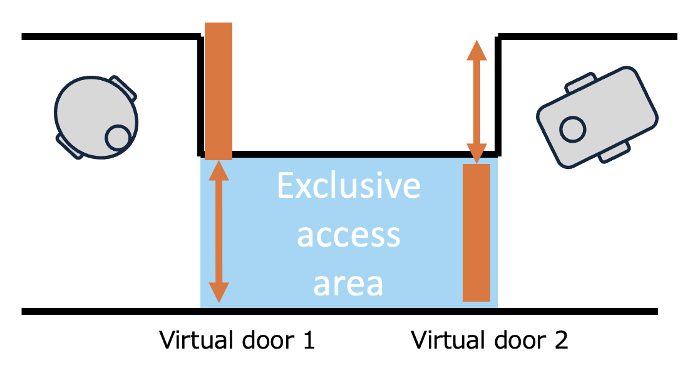
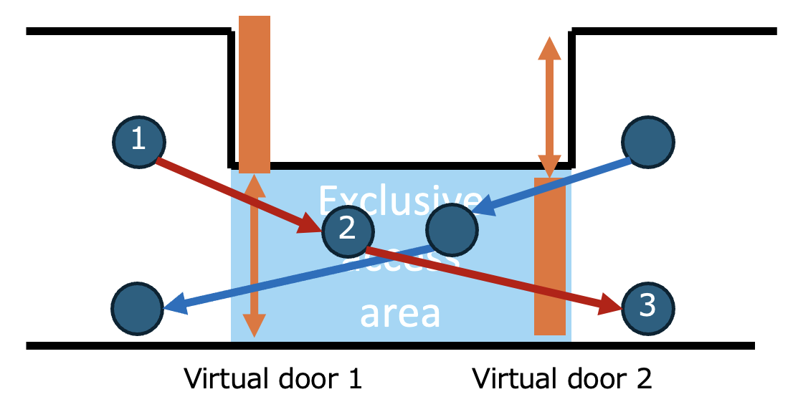
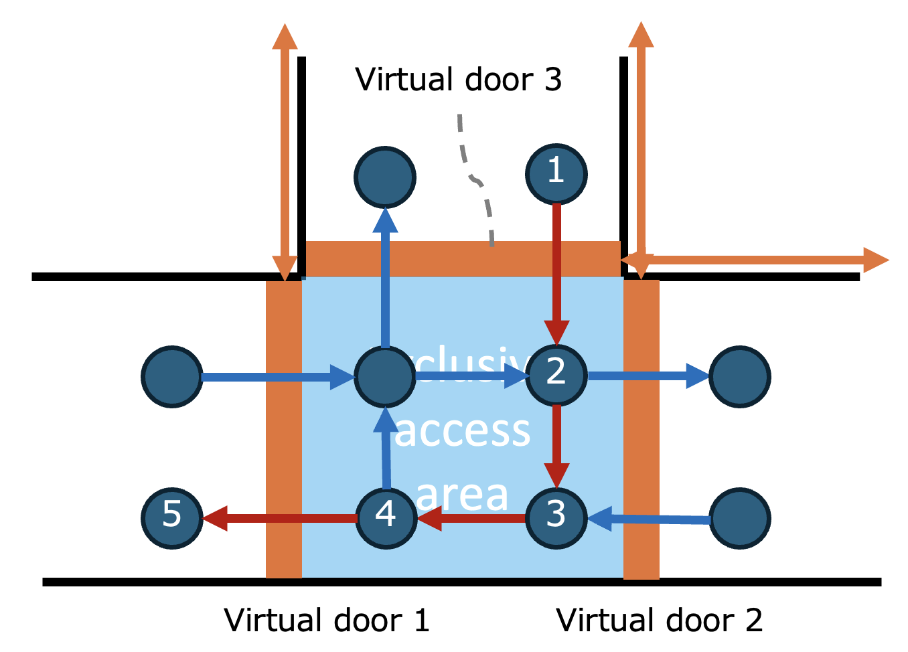
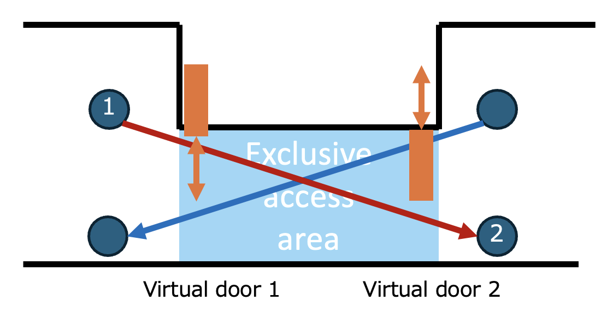

# lci_rmf_adapter (RMF Lift and Door Adapter for LCI)
This package is an implementation of RMF Lift Adapter[^1] and Door Adapter[^2] for LCI.

LCI is the cloud-based service provided by Octa Robotics, Inc[^3].

LCI supports,
- Multiple vendors of elevators (lifts) including Mitsubishi, Hitachi, Toshiba, Fujitec, OTIS and more
- Multiple vendors of doors and turnstiles including Nabco, Teraoka, Kumahira and more
- Fire alarms and seismic alarms
- Exclusive access areas among multiple systems

The protocol of LCI is open in [^5]. It is based on RFA standards[^4] on MQTT.

This package bridges ROS2 (RMF Lift and Door Adapter) to LCI.
It also works as a publisher of `/fire_alarm_trigger`.


[^1]: https://osrf.github.io/ros2multirobotbook/integration_lifts.html
[^2]: https://osrf.github.io/ros2multirobotbook/integration_doors.html
[^3]: https://www.octa8.jp/service/
[^4]: RFA is the acronym of the Robot Friendly Asset Promotion Association of Japan. RFA publishes the standards for the interfaces between robots and elevators/doors. RFA standards are available for purchase from [their homepage](https://robot-friendly.org/publication/). English version is also available.
[^5]: https://developer.lci.octa8.link/

# System requirements
- ROS2 Humble or Jazzy
- Python packages
  - paho-mqtt == 1.6.1
  - ruamel.yaml

The more detail is exemplified in [Dockerfile](Dockerfile).


# Topics
| Message Types             | ROS2 Topic                                   | Description                                                                               |
| ------------------------- | -------------------------------------------- | ----------------------------------------------------------------------------------------- |
| rmf_lift_msgs/LiftState   | `/lift_states`                               | State of the lift published by the lift node                                              |
| rmf_lift_msgs/LiftRequest | `/adapter_lift_requests` or `/lift_requests` | Requests to be sent to the lift supervisor to request operation of lifts                  |
| rmf_door_msgs/DoorState   | `/door_states`                               | State of the door published by the door node                                              |
| rmf_door_msgs/DoorRequest | `/adapter_door_requests` or `/door_requests` | Requests to be sent to the door supervisor to request operation of doors                  |
| std_msgs/Bool             | `/fire_alarm_trigger`                        | State of fire alarms to be emitted when fire signal comes from disaster prevention system |

> [!NOTE] 
> RMF defines two topics for LiftRequest: "/lift_requests" and "/adapter_lift_requests", and two topics for DoorRequest: "/door_requests" and "/adapter_door_requests".
> To support different RMF deployments, these topics can be configured using environment variables: `RMF_LIFT_REQUESTS_TOPIC` and `RMF_DOOR_REQUESTS_TOPIC`.
> Please refer to [start.sh](start.sh).


# Limitation
## For Lift
- When the robot is at the origination floor, `LiftRequest.destination_floor` shall be `"<origination>"` or `"<origination>:<destination>"`.
- After the robot entered the car, `LiftRequest.destination_floor` shall be `"<destination>"` or `"<destination>:<destination>"`.
- **`"<origination>:<destination>"` format is required especially when the backend lift API of LCI requires both `"<origination>"` and `"<destination>"` at the first request.**
- The suffix `_r` is used for the floor name to specify the rear door. This rule applies `<origination>`, `<destination>`, `LiftRequest.destination_floor` and `LiftRequest.current_floor`.

For example, if the robot wants to use the lift from `B1` of the front door to `8F` of the rear door, `LiftRequest.destination_floor` can be,

  |           | At the origination floor | After entering the car |
  | --------- | ------------------------ | ---------------------- |
  | Example 1 | `B1`                     | `8F_r`                 |
  | Example 2 | `B1:8F_r`                | `8F_r`                 |
  | Example 3 | `B1:8F_r`                | `8F_r:8F_r`            |


- The arrival at the final destination can be detected by checking if `LiftRequest.current_floor` and `LiftRequest.door_state` are `8F_r` and `LiftState.DOOR_OPEN` respectively.

## For Door

Although LCI supports directional doors (e.g. flap barrier turnstiles), which do not allow reverse passing, rmf_door_msgs does not.

To make up for this lack of functionality, lci_rmf_adapter assumes the entering direction (passing from a low-security area to a high-security area) is also applicable for the leaving direction (passing from a high-security area to a low-security area).

In case that the door detects reverse passing and closes itself when the robot is leaving via the door, please use the correct direction value `2` by extending LciRmfAdapter or other means.
See *if*-block starting with `if rd_context._lci_context._door_type == 'flap':` in [lci_rmf_adapter.py](lci_rmf_adapter/lci_rmf_adapter/lci_rmf_adapter.py).

The directional doors are marked with `lci_door_type: flap` in the config files of LCI (see [LCI files](#lci-files)).

## For Alarms
LCI supports multiple source of fire alarms for fire compartmentation. However, RMF does not provide a standard method to separate sources. Then, LCI RMF Adapter discards the source information and publish a simple `Bool` to `/fire_alarm_trigger`.

Although LCI also support seismic alarms in the same manner as fire alarms, the current LCI RMF Adapter does not forward the seismic alarms because there is no standard method in RMF.

LCI RMF Adapter never publish `false` to `/fire_alarm_trigger`, because RMF would resume tasks when `false` was received via `/fire_alarm_trigger` even after emergency situations.

Please manually send `false` to `/fire_alarm_trigger` to resume tasks after checking the environment related to robot operation. 

## For Exclusive access areas
### General
LCI supports exclusive access areas such as intersections or narrow passages. This feature is based on the "LCI Sem" service, which is a general resource management system for mutual exclusion control among multiple clients, including systems other than RMF.


This feature shall be used together with the `Mutex Group` functions of RMF in accordance with the following instructions:

- Configure the `Mutex Group` area to be larger than the exclusive access area in order to avoid race conditions between RMF and other systems.
- Configure virtual doors at the boundary between the exclusive access area and the surrounding area.
<p align="center">

</p>

- Ensure that only one requester is allowed to send MODE_OPEN DoorRequests to the virtual doors at a time.
- Clarify whether a waypoint should be placed inside the exclusive access area.

> [!NOTE]
> If you are able to customize or replace the `mutex_group_supervisor` Node of RMF, it is possible to integrate LCI Sem directly.
> However, this is often difficult in practice because it changes the behaviour of the `Mutex Group` mechanism and, moreover, RMF is typically deployed and managed by a different system integrator.
> Therefore, LCI RMF Adapter adopts the virtual door approach.


### `door_name` format
The name of an exclusive access area is of the format `/lci/<bldg_id>/sem/<resource_id>`.
Then, the `door_name` of the virtual door shall be  `/lci/<bldg_id>/sem/<resource_id>/<virtual_door_id>`.

This `<virtual_door_id>` shall be a positive integer string no more than the number defined as `num_of_vdoor` in the configuration file (e.g. [server_config_simulator.yaml](lci_config/server_config_simulator.yaml)). You may freely adjust `num_of_vdoor` in the configuration file according to the number of virtual doors required for your system configuration. This parameter is local to LCI RMF Adapter and does not affect the behaviour of the LCI system itself.

### Waypoint inside the exclusive access area
If an exclusive access area contains a waypoint, at the waypint, DoorRequest.`MODE_CLOSE` is sent to the first virtual door (the entrance), while DoorRequest.`MODE_OPEN` is sent to the second virtual door (the exit).
<p align="center">

</p>

This method is also applicable to a junction.
<p align="center">

</p>

By default, the virtual doors associated with a single exclusive access area are configured to support this method. The resource of LCI Sem will be released when DoorRequest.`MODE_CLOSE` is sent to the second virtual door (the exit).


### No waypoint inside the exclusive access area
If an exclusive access area does not contain a waypoint, DoorRequest.`MODE_CLOSE` is sent to the first virtual door (the entrance) when the robot reaches the first waypoint after exiting the exclusive access area. Then, the resource of LCI Sem will be released.
<p align="center">

</p>

To use this method, the virtual door must be configured to block only the lane from the entrance to the exclusive access area and set `has_waypoint_in_area` of the corresponding resource in `sems` field to `False` of the configuration file (e.g. [server_config_simulator.yaml](lci_config/server_config_simulator.yaml)). This method is useful for reducing the number of waypoints and improving travel time.

### Procedure
When a robot attempts to pass through a virtual door, LCI RMF Adapter acquires the access right to the corresponding area via LCI Sem.

While the access right is held, other robot systems are prevented from acquiring the access right associated with that area.

After the robot passes through the next virtual door, the LCI RMF Adapter releases the access right to the area via LCI Sem.

> [!IMPORTANT] 
> Because DoorState of the virtual doors are visible to all requesters, a requester that continuously sends DoorRequest while waiting for the access right may incorrectly determine that access has been granted.
> This occurs because the virtual door appears to be open even when the access right has actually been granted to another requester.
> Therefore, unless the above instructions are strictly followed, race conditions can inherently occur and are difficult to avoid completely under this mechanism.


### Timeout
LCI Sem monitors the elapsed time since the access rights were acquired. If the elapsed time exceeds 180 seconds (currently hardcoded in do_registration_sem() in lci_client.py), the resource is automatically released.

Therefore, please note that if a robot becomes stuck within the area and is unable to exit, the resource will eventually be released automatically after the timeout period.


# LCI files
To configure lci_rmf_adapter, the following files are needed.

- `server_config.yaml` : Config file to specify what elevators and doors are robot-ready.
- Cert files: ClientID, client certificate and private key of an LCI Robot Account.

All of them will be provided by Octa Robotics.

[server_config_simulator.yaml](lci_config/server_config_simulator.yaml) is the config file for the simulator provided by Octa Robotics.

Please contact lci@octa8.jp to obtain the LCI Robot Account for development, which is only allowed to access the simulator.


# Docker
To use lci_rmf_adapter quickly, it is recommended to use Docker.

[container_manager.sh](container_manager.sh) provides an utility for Docker.

- To use jazzy, `export ROS_DISTRO=jazzy`.
- To use CycloneDDS, `export RMW_IMPLEMENTATION=rmw_cyclonedds_cpp`.
  - If you want to use other cyclonedds.xml than cyclonedds.xml.default, `export DDS_CONFIG=<path to your cyclonedds.xml>`
- To use other ROS_DOMAIN_ID than 0, `export ROS_DOMAIN_ID=<your ROS_DOMAIN_ID>`.
- If you do not want to use the environment variables, edit [docker-compose.yml](docker-compose.yml) directly.
- Edit `LCI_SERVER_CONFIG_YAML` and `LCI_CERT_DIR` in [start.sh](start.sh) to fit your environment.
- `sudo -E ./container_manager.sh start`
  - It will build and start the container.
  - Do not forget `-E` option when you use the environment variables to configure lci_rmf_adapter.
- `sudo ./container_manager.sh login`
  - It will login you in the container environment.
- `./start.sh`
  - It will start the Node of lci_rmf_adapter.
- To automatically run `./start.sh` by `sudo -E ./container_manager.sh start`, `export RUN_ON_START=true` in advance.


# Error management

To help RMF to manage errors releated to lifts and doors, lci_rmf_adapter uses `LiftState.current_mode` and `DoorState.current_mode` as,

 | `LiftState.current_mode` | Description                                          |
 | ------------------------ | ---------------------------------------------------- |
 | `MODE_AGV`               | LCI device for the lift is online                    |
 | `MODE_OFFLINE`           | LCI device for the lift is not reachable             |
 | `MODE_EMERGENCY`         | The lift is not available due to emergency situation |
 | `MODE_UNKNOWN`           | In the deadtime after use                            |


 | `DoorState.current_mode` | Description                                                                               |
 | ------------------------ | ----------------------------------------------------------------------------------------- |
 | `MODE_CLOSED`            | LCI device for the door is online or the door is not available due to emergency situation |
 | `MODE_OPEN`              | The door is completely opened and a robot can go through it                               |
 | `MODE_OFFLINE`           | LCI device for the door is not reachable                                                  |
 | `MODE_UNKNOWN`           | In the deadtime after use                                                                 |


LCI's Elevator API and Door API are syncronous protocol based on MQTT, the asynchronous messaging protocol. lci_rmf_adapter applys appropriate retry and timeout both for LCI layer and MQTT layer. 

In `_publish()` of [lci_client.py](./lci_rmf_adapter/lci_rmf_adapter/lci_client.py),
- Timeout to receive PUBACK for the message. Timeout duration is fixed with 5s. Retry is managed by paho-mqtt.
- Timeout to receive the response from LCI devices. Timeout durations are set by `_sync_execute_with_retry()` with the maximum number of retry as,

 | LCI's command name    | Timeout duration | Max # of retry | Retry interval |
 | --------------------- | ---------------- | -------------- | -------------- |
 | Regsitration          | 180s             | 5              | 30             |
 | CallElevator          | 10s              | 2              | 5              |
 | RequestElevatorStatus | 5s               | 0              | -              |
 | RobotStatus           | 10s              | 2              | 5              |
 | Release               | 10s              | 2              | 5              |
 
If any command failed after the specified retries, lci_rmf_adapter sets its mode and publish `LiftState.current_mode` and `DoorState.current_mode` with `MODE_OFFLINE`. In the same manner, once a response from LCI indicates emergency, lci_rmf_adapter uses `MODE_EMERGENCY` for lifts and `MODE_UNKNOWN` for doors.

After a specific duration, `MODE_OFFLINE`, `MODE_EMERGENCY` and `MODE_UNKNOWN` will be overrided by `MODE_AGV` or `MODE_CLOSED` to inform "pseudo-online" to induce RMF to send LiftRequest or DoorRequest.

After use of a lift or a door, their internal states will get unstable for several seconds for resetting. To assure this pereiod, lci_rmf_adapter uses `MODE_UNKNOWN` until 10s passed after usage.

RMF and its peripheral module shall manage these errors to assure safe operations.


# Client examples
## For Lift

ROS2 Node example is found in [the test code for lift](lci_rmf_adapter/lci_rmf_adapter/lci_rmf_adapter_lift_test.py).

Its entry point is [test_client_lift.sh](test_client_lift.sh)

Please edit `LIFT_NAME`, `ORIGINATION` and `DESTINATION` in [test_client_lift.sh](test_client_lift.sh) for trial.

`LIFT_NAME` is of the format `/lci/<bldg_id>/<bank_id>/<elevator_id>`.

## For Door

ROS2 Node example is found in [the test code for door](lci_rmf_adapter/lci_rmf_adapter/lci_rmf_adapter_door_test.py).

Its entry point is [test_client_door.sh](test_client_door.sh)

Please edit `DOOR_NAME` in [test_client_door.sh](test_client_door.sh) for trial

`DOOR_NAME` is of the format `/lci/<bldg_id>/<floor_id>/<door_id>`.

## For Virtual Door (Exclusive access area)

ROS2 Node example is found in [the test code for virtual doors bound with LCI Sem](lci_rmf_adapter/lci_rmf_adapter/lci_rmf_adapter_sem_virtual_door_test.py).

Its entry point is [test_client_sem_virtual_door.sh](test_client_sem_virtual_door.sh)

Please edit `RESOURCE_NAME` in [test_client_sem_virtual_door.sh](test_client_sem_virtual_door.sh) for trial

`RESOURCE_NAME` is of the format `/lci/<bldg_id>/sem/<resource_id>/`.

This `<virtual_door_id>` shall be a positive integer string no more than the number defined as `num_of_vdoor` in the configuration file (e.g. [server_config_simulator.yaml](lci_config/server_config_simulator.yaml))

## Separater for device names
RMF Web have a trouble with slash separated lift_name and door_name because it may require those values to be URL safe.

To avoid their limitation, the separater replacement function is supported.
See `LCI_DEVICE_NAME_SEPARATER` in [start.sh](start.sh).

## Floor name aliases
LCI uses floor identifiers such as 1F, 2F, and 3F for `floor_id`. However, some RMF systems use a level-based naming scheme instead, such as L1, L2, and L3.

For buildings that use level-based identifiers, this adapter supports floor name aliases.

To enable this feature, add a `floor_name_aliases` mapping to the configuration file using the following format:

``` yaml
floor_name_aliases:
  "<floor_name_alias>": "<floor_id>"
```

For an example configuration, see the commented section at the bottom of [server_config_simulator.yaml](lci_config/server_config_simulator.yaml).

When configured, the adapter automatically:
- Converts LCI-style `floor_id` values to the corresponding `floor_name_alias` in LiftState and DoorState messages.
- Interprets `floor_name_alias` values in `LiftRequest` and `DoorRequest` messages and converts them to the corresponding LCI-style `floor_id`.


# Use LCI directly

LCI does not only support the elevators (lifts), the doors and the alarms but also,
- automatic setting and releasing of security systems
- the exclusive control of resoruces among multiple robot systems (**LCI Sem**)
- the messaging service between robots and humans (**LCI Bell**)
- the telemetry service for robots (**LCI Board**)


To use full functionaly of LCI, please use MQTT with reference to [LCI Developer Portal](https://developer.lci.octa8.link/).

[lci_client.py](lci_rmf_adapter/lci_rmf_adapter/lci_client.py) is an implementation of LCI client without ROS2.
